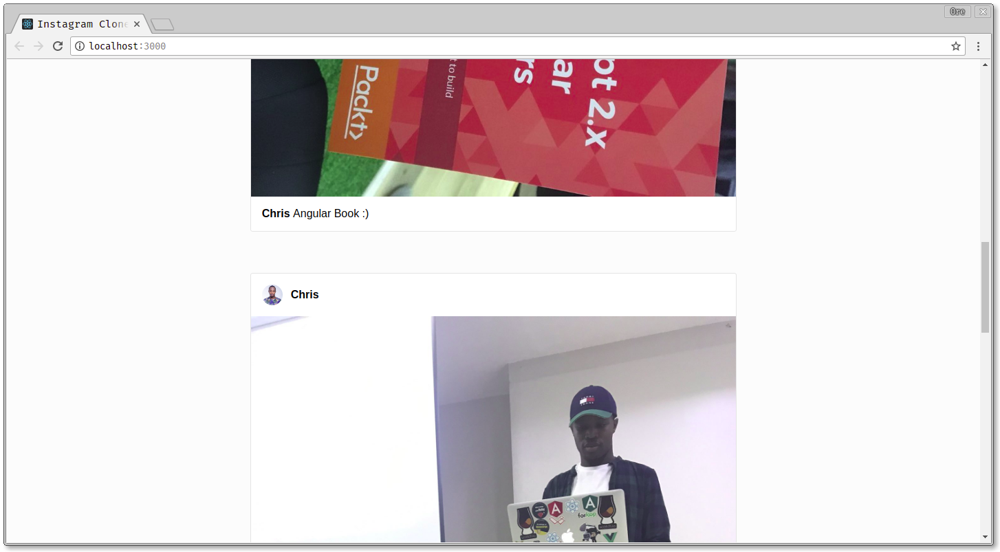
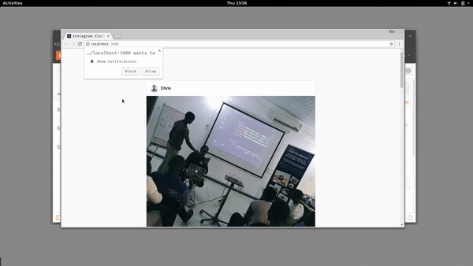
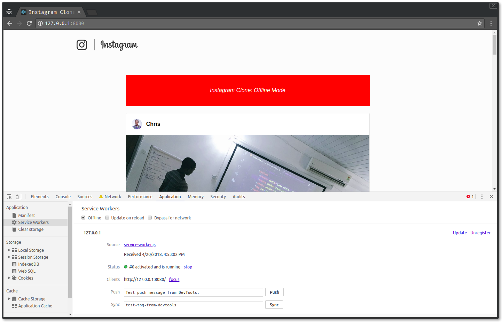

# React Series: Building a Simple Instagram Clone

This is a demo application showing how to build a simple Instagram Clone using React and GraphQL with Realtime Functionality and Offline Support with Service Workers.

View tutorial: [Part 1](https://pusher.com/tutorials/instagram-clone-part-1) [Part 2](https://pusher.com/tutorials/instagram-clone-part-2) [Part 3](https://pusher.com/tutorials/instagram-clone-part-3) [Part 4](https://pusher.com/tutorials/instagram-clone-part-4)







## Getting Started
Follow these instructions to get a copy of this project up and running on your local machine for development and testing purposes.

### Prerequisites
- Git
- Node
- NPM / Yarn
- React
- GraphQL

### Install 
Clone the repository

```
$ git clone https://github.com/christiannwamba/instagram-clone.git
```

Install dependecies for Frontend
```
$ cd instagram-clone
$ npm install
```

Install dependencies for GraphQL server
```
$ cd instagram-clone/server
$ npm install
```

**Using Pusher**
To add realtime functionality, you need Pusher. Head over to [Pusher](https://pusher.com) and create a new application.

> Note your application keys.

- Edit your `server/server.js` and add your application credentials
- Edit the `src/App.js` and add your application keys so you can connect to pusher.


### Run the application
- Start backend server
```
$ node server
```

[Development] 
- Run Frontend
```
$ npm start
```

[Production] 
- Build Frontend
```
$ npm run build
```

- Serve static files with `http-server`
```
$ npm install http-server
$ http-server build
```

> Ensure your backend server is running simultaneously

## Built With
- [React](https://reactjs.org) - A Javascript library for building user interfaces
- [Express](https://expressjs.com) - Node.js web application framework
- [GraphQL](https://graphql.org) - A Query language for APIs and a runtime for fulfilling those queries with your existing data.
- [ApolloClient](https://www.apollographql.com/client) - Apollo Client is the ultra-flexible, community-driven GraphQL client for React, JavaScript, and native platforms.
- [Pusher](https://pusher.com) - Leaders in realtime technologies. We empower all developers to create live features for web and mobile apps with our simple hosted API.

## Acknowledgments
- [Pusher](https://pusher.com) -  Easy to use getting started guide
- [React](https://reactjs.org) - Great documentation easy to use
- [Matt Gaunt](https://developers.google.com/web/fundamentals/primers/service-workers/) - Great introduction to service workers

